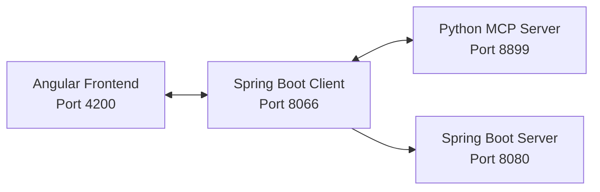

Of course! Here is an enhanced and condensed version of your README.md.

The design has been improved using badges, emojis, tables, and collapsible sections for better readability and a more professional look. The text has been shortened by removing redundancy and combining sections, making it easier for users to get started quickly.

I've also moved the very long list of screenshots into a separate `SCREENSHOTS.md` file, which is a common practice to keep the main README clean. You would simply create a new file named `SCREENSHOTS.md` and paste the original screenshot section into it.

---

# 🚀 MCP Project: Spring, Python & Angular

[](https://opensource.org/licenses/MIT)
[](https://spring.io/projects/spring-boot)
[](https://www.python.org/)
[](https://angular.io/)

A comprehensive Model Context Protocol (MCP) implementation featuring a Spring Boot client, Python server, and Angular frontend. This system demonstrates AI-powered chat with tool integration for real-world tasks.

**Author:** Adam IMLOUL (Master SDIA)

---

### ✨ Key Features

*   **🤖 AI Chat Interface:** Modern, responsive chat with memory-aware conversations and real-time "thinking" visualization.
*   **🛠️ Powerful Tool Integration:**
    *   📈 **Stock Information:** Get real-time stock data.
    *   🏢 **Company Data:** Look up enterprise information.
    *   📂 **File System:** Manage files and directories.
    *   👥 **Employee Management:** Access HR data.
*   **💻 Robust Backend:** Built with Spring Boot, Spring AI, and a separate Python server for hosting tools.
*   **🎨 Modern Frontend:** A sleek and intuitive UI built with Angular.

### 🏛️ Architecture

The system is composed of four main services that communicate with each other to deliver the full functionality.

| Service                | Technology    | Port      | Description                                |
| ---------------------- | ------------- | --------- | ------------------------------------------ |
| **Angular Frontend**   | Angular       | `4200`    | User-facing chat interface.                |
| **Spring Boot Client** | Spring Boot   | `8066`    | Main API gateway and AI orchestration.     |
| **Python MCP Server**  | Python        | `8899`    | Hosts the AI tools (stocks, files, etc.).  |
| **Spring Boot Server** | Spring Boot   | `8080`    | *(Optional)* Enterprise services.         |



### 🛠️ Tech Stack

| Category      | Technologies                                       |
| ------------- | -------------------------------------------------- |
| **Backend**   | Java 17+, Spring Boot 3, Spring AI, JPA, H2, Maven |
| **Frontend**  | Angular 20, TypeScript, RxJS, HTML5, CSS3          |
| **AI / Python** | Python 3.8+, FastAPI, MCP SDK, Ollama (Qwen3)      |

### 🚀 Getting Started

Follow these steps to get the project running locally.

#### 1. Prerequisites
*   Java 17+
*   Node.js 18+
*   Python 3.8+
*   [Ollama](https://ollama.ai/) installed and running.
*   Angular CLI: `npm install -g @angular/cli`

#### 2. Clone the Repository
```bash
git clone https://github.com/scorpionTaj/mcp-project-spring-python.git
cd mcp-project-spring-python
```

#### 3. Start the Services (in order)

1.  **AI Model (Ollama)**
    ```bash
    # Start the Ollama service
    ollama serve

    # In a new terminal, pull the required model
    ollama pull qwen3
    ```

2.  **Python MCP Server**
    ```bash
    cd mcp-server-python
    # Activate virtual env (e.g., source .venv/bin/activate)
    pip install -r requirements.txt
    python server.py
    # Should be running on http://localhost:8899
    ```

3.  **Spring Boot MCP Client**
    ```bash
    cd mcp-client
    ./mvnw spring-boot:run
    # Should be running on http://localhost:8066
    ```

4.  **Angular Frontend**
    ```bash
    cd mcp-frontend
    npm install
    ng serve
    # Should be running on http://localhost:4200
    ```

#### 4. Access the Application
*   **Frontend:** [**http://localhost:4200**](http://localhost:4200)
*   **API Docs (Swagger):** [**http://localhost:8066/swagger-ui.html**](http://localhost:8066/swagger-ui.html)

### ⚙️ Configuration

Key settings are managed in `mcp-client/src/main/resources/application.properties`.

<details>
<summary><strong>Click to view key configuration options</strong></summary>

```properties
# Server Port
server.port=8066

# AI Model Configuration (change 'qwen3' to 'llama2', 'mistral', etc.)
spring.ai.ollama.base-url=http://localhost:10000
spring.ai.ollama.chat.model=qwen3

# MCP Python Server Connection
spring.ai.mcp.client.sse.connections.server1.url=http://localhost:8899
spring.ai.mcp.client.sse.connections.server1.sse-endpoint=/sse

# Database
spring.datasource.url=jdbc:h2:mem:testdb
spring.h2.console.enabled=true
```
</details>

### 📁 Project Structure
```
mcp-project-spring-python/
├── mcp-client/         # Spring Boot Client (Main API)
├── mcp-server/         # Spring Boot Server (Enterprise Services)
├── mcp-server-python/  # Python Server (AI Tools)
├── mcp-frontend/       # Angular Frontend (UI)
├── Screenshots/        # Project screenshots
└── README.md
```

### 🖼️ Screenshots

For a visual tour of the application, including the UI, tool interactions, and API testing, please see the **[Screenshots Page](SCREENSHOTS.md)**.

### 🗺️ Roadmap & Contributing

We welcome contributions! Feel free to open an issue or submit a pull request.

*   **Planned Features:**
    *   [ ] WebSocket support for real-time chat
    *   [ ] User authentication & authorization
    *   [ ] Database persistence for chat history
    *   [ ] Docker containerization
*   **Contribution Ideas:**
    *   Add new tools (weather, news APIs)
    *   Improve the UI/UX
    *   Add internationalization (i18n)

### 📄 License

This project is licensed under the **MIT License**. See the [LICENSE](LICENSE) file for details.

---

Made with ❤️ by **Adam IMLOUL**
